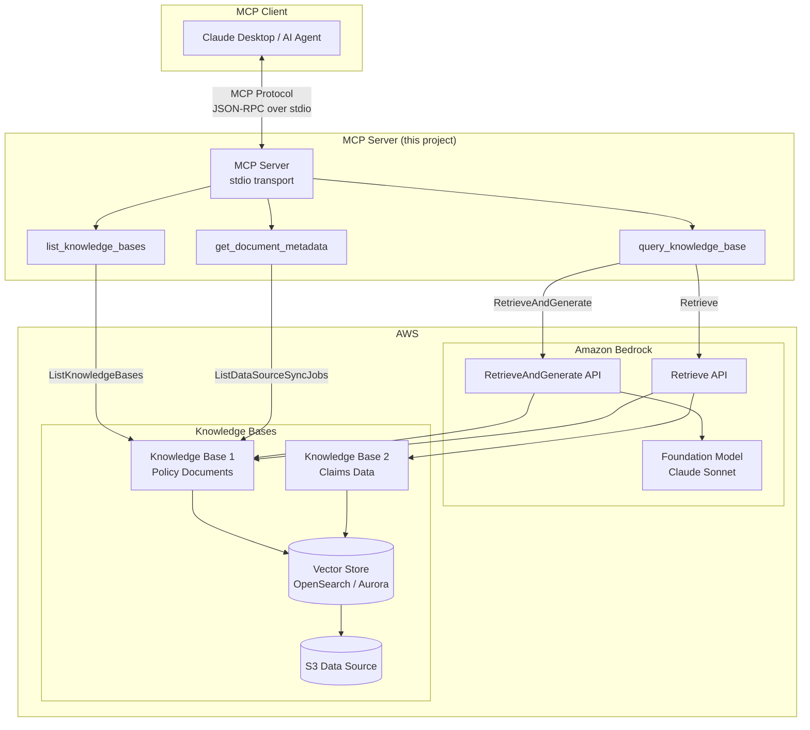

# MCP Server: Amazon Bedrock Knowledge Bases

An MCP (Model Context Protocol) server that exposes Amazon Bedrock Knowledge Bases as tools for AI agents. Enables any MCP-compatible client (Claude Desktop, custom agents) to perform semantic search and RAG queries against enterprise knowledge stores.

## Architecture



## Features

- **RAG Queries** - Query knowledge bases with synthesized, citation-backed answers using RetrieveAndGenerate
- **Semantic Search** - Retrieve raw passages with relevance scores for custom processing
- **Metadata Filtering** - Filter results by document attributes (AND/OR logic) for precise retrieval
- **Multiple Knowledge Bases** - Configure and query across multiple KBs from a single server
- **Configurable Retrieval** - Control result count, search type (HYBRID/SEMANTIC), and model selection
- **Production Security** - IAM-based auth, least-privilege access, no credentials in config files
- **Proper Error Handling** - Typed exceptions, graceful degradation, structured error responses

## Prerequisites

- Python 3.10+
- AWS credentials with Bedrock Knowledge Base permissions
- At least one Amazon Bedrock Knowledge Base provisioned

### Required IAM Permissions

```json
{
  "Version": "2012-10-17",
  "Statement": [
    {
      "Effect": "Allow",
      "Action": [
        "bedrock:Retrieve",
        "bedrock:RetrieveAndGenerate",
        "bedrock:ListKnowledgeBases",
        "bedrock:ListDataSourceSyncJobs"
      ],
      "Resource": "arn:aws:bedrock:*:*:knowledge-base/*"
    },
    {
      "Effect": "Allow",
      "Action": "bedrock:InvokeModel",
      "Resource": "arn:aws:bedrock:*::foundation-model/*"
    }
  ]
}
```

## Installation

```bash
# Clone the repository
git clone https://github.com/YOUR_USERNAME/mcp-server-bedrock-knowledge-base.git
cd mcp-server-bedrock-knowledge-base

# Install with pip (editable mode for development)
pip install -e ".[dev]"

# Or install from requirements.txt
pip install -r requirements.txt
```

## Configuration

All configuration is via environment variables:

| Variable | Default | Description |
|----------|---------|-------------|
| `AWS_REGION` | `us-west-2` | AWS region for API calls |
| `AWS_PROFILE` | (default chain) | AWS profile name |
| `BEDROCK_KB_IDS` | (all accessible) | Comma-separated KB IDs to expose |
| `BEDROCK_KB_MODEL_ID` | Claude Sonnet | Foundation model ARN for generation |
| `BEDROCK_KB_LOG_LEVEL` | `INFO` | Logging level |
| `BEDROCK_KB_RETRIEVAL_NUMBER_OF_RESULTS` | `5` | Default result count |
| `BEDROCK_KB_RETRIEVAL_SEARCH_TYPE` | `HYBRID` | Default search type |

## Usage with Claude Desktop

Add to your Claude Desktop configuration (`~/Library/Application Support/Claude/claude_desktop_config.json`):

```json
{
  "mcpServers": {
    "bedrock-knowledge-base": {
      "command": "python",
      "args": ["-m", "src.server"],
      "cwd": "/path/to/mcp-server-bedrock-knowledge-base",
      "env": {
        "AWS_REGION": "us-west-2",
        "AWS_PROFILE": "bedrock",
        "BEDROCK_KB_IDS": "KB1234567890"
      }
    }
  }
}
```

## Tools

### `query_knowledge_base`

Query a knowledge base with natural language. Supports both RAG (generated answers) and raw retrieval modes.

**Parameters:**
| Parameter | Type | Required | Description |
|-----------|------|----------|-------------|
| `knowledge_base_id` | string | Yes | Target KB ID |
| `query` | string | Yes | Natural language query |
| `number_of_results` | int | No | Results to retrieve (1-100) |
| `search_type` | string | No | `HYBRID` or `SEMANTIC` |
| `generate_response` | bool | No | True for RAG, False for raw passages |
| `filter_and` | list | No | AND metadata filters |
| `filter_or` | list | No | OR metadata filters |

**Example - RAG Query:**
```
Query the knowledge base KB123 about "What are the coverage limits for flood insurance in Florida?" with metadata filter for document_type equals "policy"
```

**Example - Semantic Search:**
```
Search KB123 for "claims processing SLA" without generating a response, return 10 results
```

### `list_knowledge_bases`

List available knowledge bases with their status and descriptions.

**Parameters:**
| Parameter | Type | Required | Description |
|-----------|------|----------|-------------|
| `max_results` | int | No | Max results (default: 10) |
| `next_token` | string | No | Pagination token |

### `get_document_metadata`

Inspect document ingestion status and metadata for a data source.

**Parameters:**
| Parameter | Type | Required | Description |
|-----------|------|----------|-------------|
| `knowledge_base_id` | string | Yes | KB ID |
| `data_source_id` | string | Yes | Data source ID |
| `document_uri` | string | No | Filter to specific document |

## Development

```bash
# Install dev dependencies
pip install -e ".[dev]"

# Run tests
pytest

# Run with verbose output
pytest -v --tb=short

# Lint
ruff check src/ tests/
ruff format src/ tests/
```

## Project Structure

```
mcp-server-bedrock-knowledge-base/
├── src/
│   ├── __init__.py
│   ├── server.py          # MCP server + tool definitions
│   ├── bedrock_client.py  # Bedrock KB API wrapper
│   ├── config.py          # Environment-based configuration
│   ├── models.py          # Pydantic request/response models
│   └── auth.py            # IAM authentication helper
├── tests/
│   └── test_server.py     # Unit tests with mocked AWS calls
├── examples/
│   ├── claude_desktop_config.json
│   └── usage.py           # Programmatic MCP client example
├── pyproject.toml
├── requirements.txt
└── README.md
```

## License

MIT
